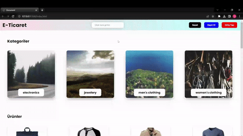

<h1>E-COMMERCE-SITE</h1>

This project represents a dynamic and interactive e-commerce website developed using Javascript. It offers customers the opportunity to explore various products, review them, add to cart, and remove from the cart.

<h2>Features</h2>

<ul>
        <li>Created using Html, Css and Javascript</li>
        <li>Full responsive</li>
        <li>Product data pulled from a real-time API</li>
        <li>Different animations are used</li>
</ul>

<h2>Screen Gif</h2>

